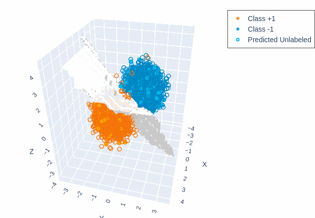
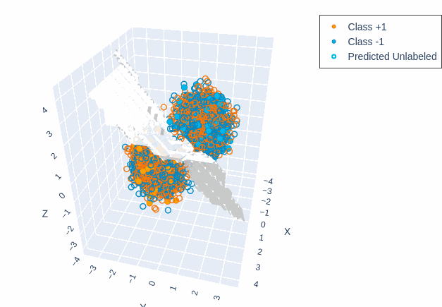
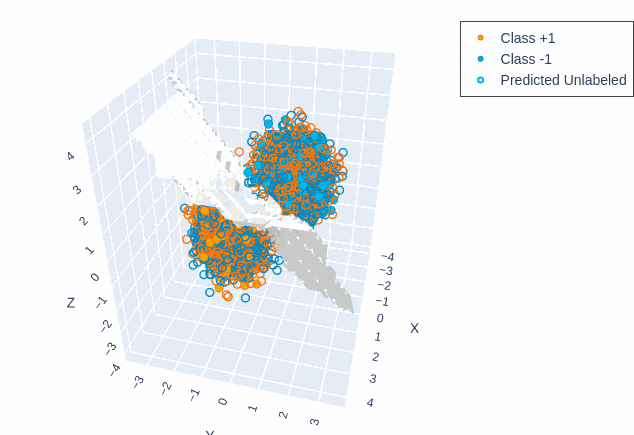
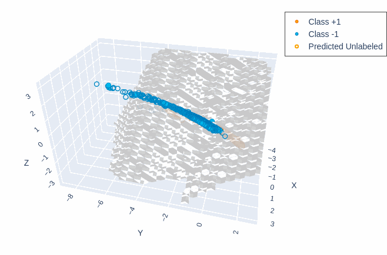
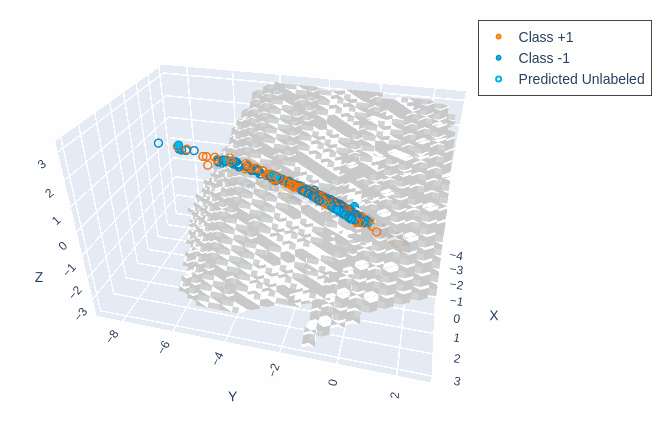
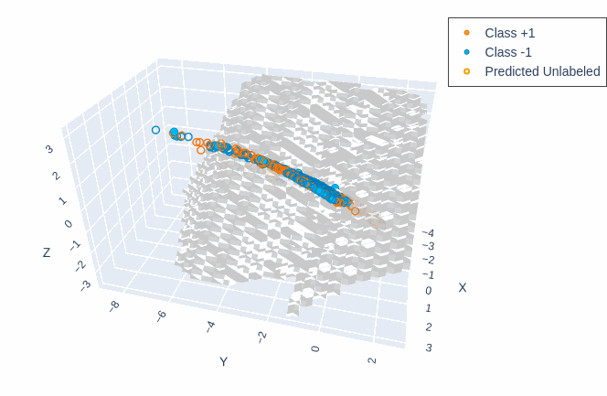
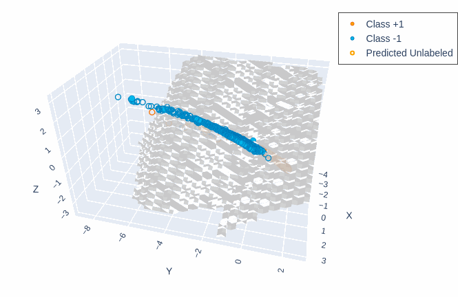

# optimization-demo-gd-vs-bcgd-and-gradient-caching
Experimenting with gradient caching in Gauss-Southwell Block Coordinate Gradient Descent (BCGD-GS), compared to batch Gradient Descent (GD) for semi-supervised learning.

**Authors**: [Mikael Poli](https://github.com/mikaelpoli) and Hazeezat Adebayo.

---

## Project Structure

The project is organized into several directories and files:

- **main.ipynb**: This is the main notebook for the project. It contains the primary implementation of the code.
- **src/**: This directory contains the custom libraries that we developed for this project.
- **results/**: Here you will find the plots comparing the performance of the different algorithms implemented in the project, as well as the JSON files containing the numerical results of the algorithms, divided by dataset.

## Running the Code

To run the project:

1. Upload the entire project folder, `ods-demo`, to the "My Drive" section of your Google Drive. If you upload it to any other section or rename the folder, make sure to update the project's path in `main.ipynb`.
2. Open `main.ipynb` in Google Colab to run the implementation. All required dependencies should be included in the `src/` directory.

---

## Results

<<<<<<< HEAD
<<<<<<< HEAD
For full implementation details, check out the [report](./ods-demo/report.pdf). Here's a brief summary of our experiments and findings:
=======
For full implementation details, check out the [report](./report.pdf). Here's a brief summary of our experiments and findings:
>>>>>>> 1b2e1e517e8ed4e4776e468f696e0fa4403f34be
=======
For full implementation details, check out the [report](./report.pdf). Here's a brief summary of our experiments and findings:
>>>>>>> 1b2e1e517e8ed4e4776e468f696e0fa4403f34be

### Experiments

We compared batch gradient descent (GD) with four versions of Gauss-Southwell Block Coordinate Gradient Descent (BCGD-GS):

- With gradient caching:
  - 1D blocks
  - 10D blocks
  - 100D blocks

- Without gradient caching:
  - 1D blocks

### Datasets:

- 3D Toy dataset (used as a sanity check):
  - GD
  - BCGD-GS 1D (with and without gradient caching)

- Real-world dataset ([Rice Type Classification](https://www.kaggle.com/datasets/mssmartypants/rice-type-classification)):
  - GD
  - BCGD-GS 1D (with and without gradient caching)
  - BCGD-GS 10D and 100D (with gradient caching)

### Performance (CPU Time in seconds)

Gradient caching halved the per-iteration CPU time of BCGD-GS. GD and BCGD-GS without caching took about 1s per iteration, while the cached versions ran in ~0.5s/iteration, regardless of block size.

### Accuracy

GD had the best accuracy overall. BCGD-GS with 1D blocks (with or without caching) performed the worst. Larger blocks improved BCGD-GS's accuracy, and the 100D version matched GD.

<strong>Figure 1:</strong> Classification results on the toy dataset.

  <table>
    <tr>
      <td align="center">
<<<<<<< HEAD
<<<<<<< HEAD
         
        <em>Fig. 1a: GD.</em>
      </td>
      <td align="center">
         
        <em>Fig. 1b: BCGD-GS 1D without gradient caching.</em>
      </td>
      <td align="center">
         
=======
=======
>>>>>>> 1b2e1e517e8ed4e4776e468f696e0fa4403f34be
         
        <em>Fig. 1a: GD.</em>
      </td>
      <td align="center">
         
        <em>Fig. 1b: BCGD-GS 1D without gradient caching.</em>
      </td>
      <td align="center">
         
<<<<<<< HEAD
>>>>>>> 1b2e1e517e8ed4e4776e468f696e0fa4403f34be
=======
>>>>>>> 1b2e1e517e8ed4e4776e468f696e0fa4403f34be
        <em>Fig. 1c: BCGD-GS 1D with gradient caching.</em>
      </td>
    </tr>
  </table>

 

<strong>Figure 2:</strong> Classification results on the Rice Type Classification dataset.

  <table>
    <tr>
      <td align="center">
<<<<<<< HEAD
<<<<<<< HEAD
         
        <em>Fig. 2a: GD.</em>
      </td>
      <td align="center">
         
        <em>Fig. 2b: BCGD-GS 1D without gradient caching.</em>
      </td>
      <td align="center">
         
=======
=======
>>>>>>> 1b2e1e517e8ed4e4776e468f696e0fa4403f34be
         
        <em>Fig. 2a: GD.</em>
      </td>
      <td align="center">
         
        <em>Fig. 2b: BCGD-GS 1D without gradient caching.</em>
      </td>
      <td align="center">
         
<<<<<<< HEAD
>>>>>>> 1b2e1e517e8ed4e4776e468f696e0fa4403f34be
=======
>>>>>>> 1b2e1e517e8ed4e4776e468f696e0fa4403f34be
        <em>Fig. 2c: BCGD-GS 1D with gradient caching.</em>
      </td>
    </tr>
  </table>

 

  <table>
    <tr>
      <td align="center">
<<<<<<< HEAD
<<<<<<< HEAD
         
        <em>Fig. 2d: BCGD-GS 10D with gradient caching.</em>
      </td>
      <td align="center">
         
=======
=======
>>>>>>> 1b2e1e517e8ed4e4776e468f696e0fa4403f34be
         
        <em>Fig. 2d: BCGD-GS 10D with gradient caching.</em>
      </td>
      <td align="center">
         
<<<<<<< HEAD
>>>>>>> 1b2e1e517e8ed4e4776e468f696e0fa4403f34be
=======
>>>>>>> 1b2e1e517e8ed4e4776e468f696e0fa4403f34be
        <em>Fig. 2e: BCGD-GS 100D with gradient caching.</em>
      </td>
    </tr>
  </table>

